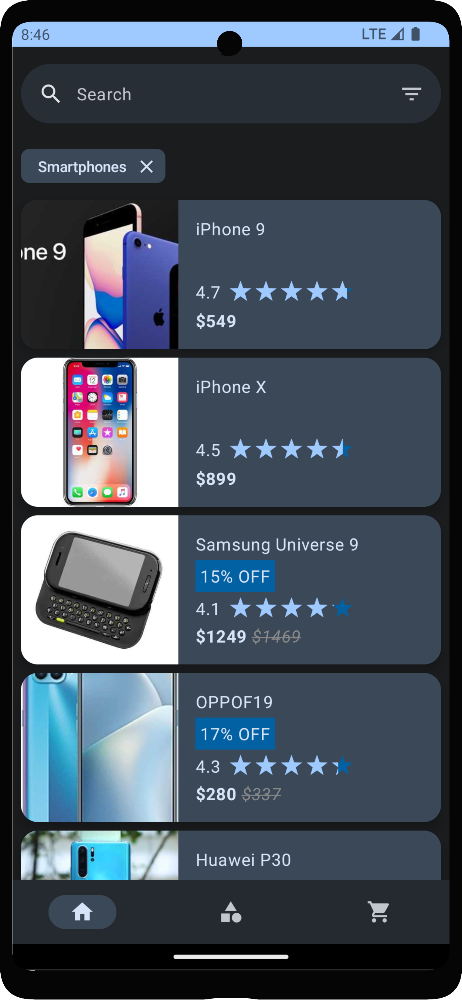

# ChickyCart Shopping
An Android e-commerce shopping app built primarily with Jetpack Compose, Material 3, Paging 3, and based on Clean Architecture guidelines to provide users with a seamless and easy shopping experience. It offers a range of features in the app, and importantly, the project is built with a robust and efficient project structure. The main goal of the project is for learning purposes; it does not show real data nor offer payment options, it just shows unreal products.

## Features
1. **Product Listing**: ChickyCart showcases a diverse range of products through a clean and responsive UI built with Material Design Components.

2. **Search, Filter, and Sort**: Easily discover products with the intuitive search functionality. Additionally, users can filter and sort products based on various criteria, enhancing their shopping experience.

3. **Product Details**: Showing detailed information about a product such as images, price, description, rating, and discounts.

4. **Shopping Cart**: Easily add products to the shopping cart with your needed quantity.

5. **Checkout and Order Placement**: Experience a smooth and simple checkout process, ensuring users can easily proceed to checkout and place orders. (The app does not actually place orders as mentioned above)

## Technical Background
* **Jetpack Compose**: ChickyCart is built with Jetpack Compose, Android's new UI toolkit, to craft modern and responsive user interfaces.

* **MVI and Clean Architecture**: The project adopts the Model-View-Intent (MVI) architecture combined with Clean Architecture principles. This approach promotes a clear separation of concerns, making the codebase more maintainable and scalable, ultimately ensuring a robust and understandable structure for the project.

* **Kotlin Coroutines**: Managing asynchronous tasks is done using Kotlin Coroutines simplifying complex asynchronous operations, contributing to more readable and concise code, and enhancing overall application performance.

* **Android Architecture Components' ViewModel**: Using the ViewModel from Android Architecture Components to manage UI-related data in a lifecycle-conscious manner. This separation ensures a more robust and lifecycle-conscious handling of data, preventing unnecessary re-fetching and improving overall application stability.

* **Hilt DI (Dependency Injection)**: Dagger-Hilt DI is used to enhance code organization and modularity, providing a clean way to manage dependencies.

* **Paging 3**: Used to efficiently load and display large sets of product data. This library enables seamless pagination, fetching only the data needed for the current view, resulting in improved performance and a smoother scrolling experience.

* **Ktor**: For fetching the products from the internet.

* **DataStore**: A modern data storage solution to persist data instead of SharedPreferences.

* **Products API**: The displayed products' data in the app and their images are taken from dummyjson.com with some modifications applied.

* **Navigation Compose**: Navigation between screens within the app. Type-safety is added to the routes and the arguments as well.

* **Coil**: Image loading library for efficiently loading images from the internet.

* **Responsive UI**: The app features a responsive user interface that adapts seamlessly to different screen sizes. Whether using the app on a mobile device or a tablet the experience remains consistent and user-friendly.

* **Enhanced UI/UX**: The app incorporates loading animations such as Shimmer as well as supporting light and dark modes with beautiful UI using Material Design Components. 

## Screenshots

### Phones (Handsets)

 

 

 

 

 

 

### Tablets

## About
The app is developed by me: [_**Amr Salaheddin Abdelhady**_](https://www.linkedin.com/in/amrsalah3)

Happy coding with ChickyCart! 🛒🐔
